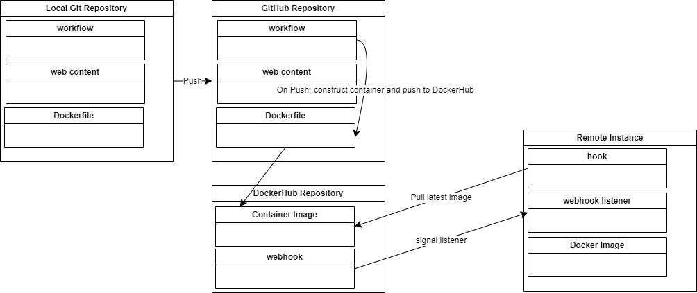

- Project Overview: Use git tag metadata and gitHub Actions to implement semantic vesioning. Use webhook to deploy docker image to remote instance

- Generate tag with git: git tag v1.1.0

- Push tag to gitHub: git push origin v1.1.0

- The workflow triggers when a tag with a pattern of v*.* is pushed and pushes docker images with semantic versioning (latest, major, major.minor) to dockerHub.

- DockerHub: https://hub.docker.com/repository/docker/marcvs99/ceg3140_project4/general

- install docker on Ubuntu: sudo apt-get install docker

- Container Restart Script: located in /home/ubuntu on instance. Stops and removes existing containers, pulls latest from dockerHub, runs container from image.

- set up webhook on ubuntu instance: sudo apt-get install webhook

- Webhook task file: json file defines tasks to execute when recieves signal. located in home direcory.

- Start webhook: webhook -hooks hooks.json -verbose

- edit /lib/systemd/system/webhook.service to point to /home/ubuntu/hooks.json

- Configure DockerHub to message listener: go to docker repo > webhooks. add new webhook using url of listener http://54.236.187.103:9000/hooks/redeploy-webhook

