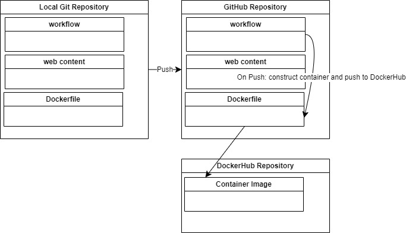

- OVERVIEW: Create a container to host web content locally and use GitHub actions

  

- Install Docker
	* apt install docker.io
- Build Image
	* docker build -t my-apache-server /path/to/directory/containing/dockerfile
- Run the container
	* docker run -d -p 80:80 my-apache-server
- View project running
	* in browser: http://127.0.0.1/
- Create Docker Repo
	* Repositories: click create repository -> fill in details
- Login to DockerHub through CLI
	* docker login
	* [enter username]
	* [enter password or access token]
	* Access token is reccomended because permissions can be specified, and tokens can be revoked.
- Push container image to Dockerhub
	* tag image:  docker tag my-apache-server:latest marcvs99/ceg3140_project4:1.0.0
	* login to DockerHub
	* Push image to repo: docker push marcvs99/ceg3140_project4:1.0.0
- Link to repository: https://hub.docker.com/repository/docker/marcvs99/ceg3140_project4
- Configure gitHub secrets
	* navigate to github repo -> settings -> secrets -> new repository secret
	* secrets set: DOCKERHUB_USERNAME, DOCKERHUB_PASSWORD
- GitHub workflow:
	* variables used are DOCKERHUB_USERNAME, DOCKERHUBPASSWORD
	* the workflow script logs into DockerHub using secrets defined above, then builds and pushes the image to Dockerhub using https://github.com/docker/build-push-action/tree/v2/
	* the script runs on git push
 
 
